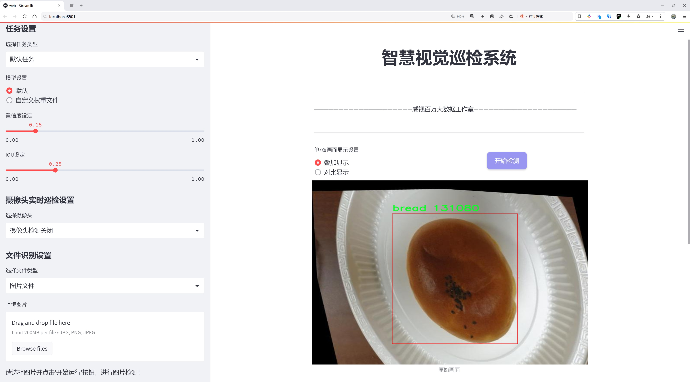
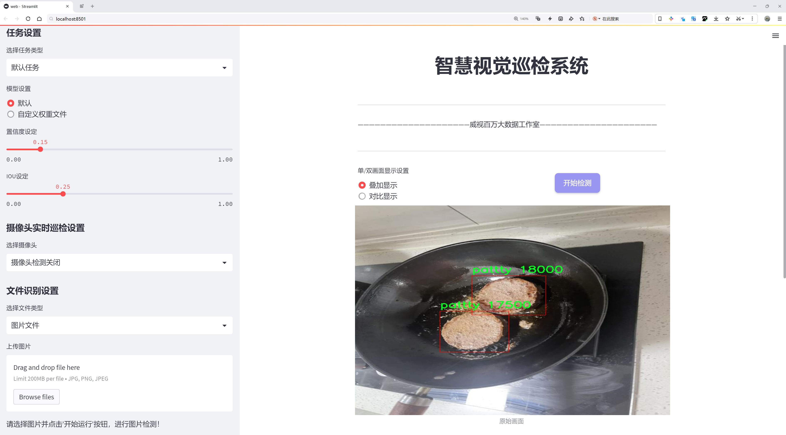
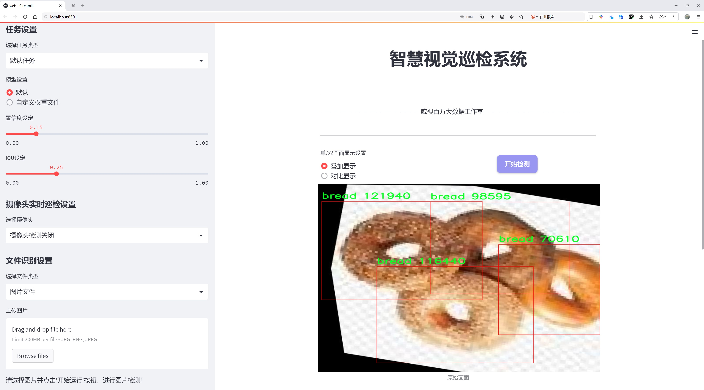
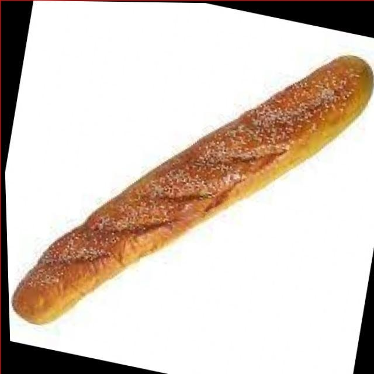
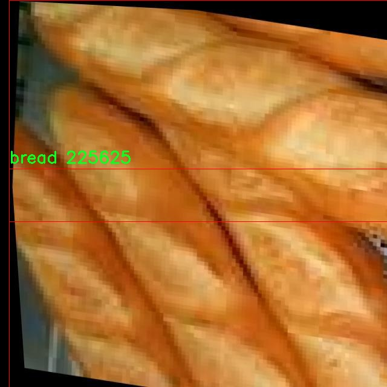
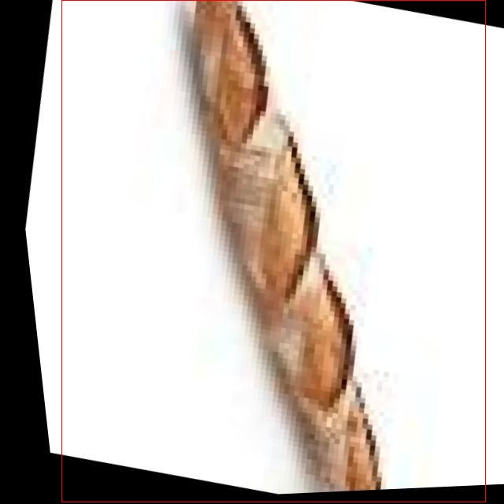
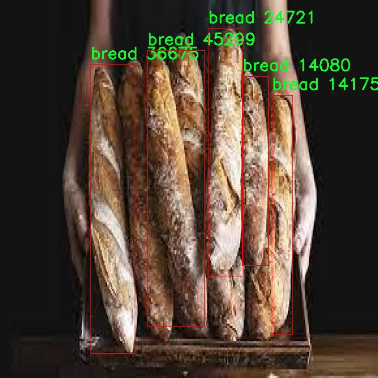
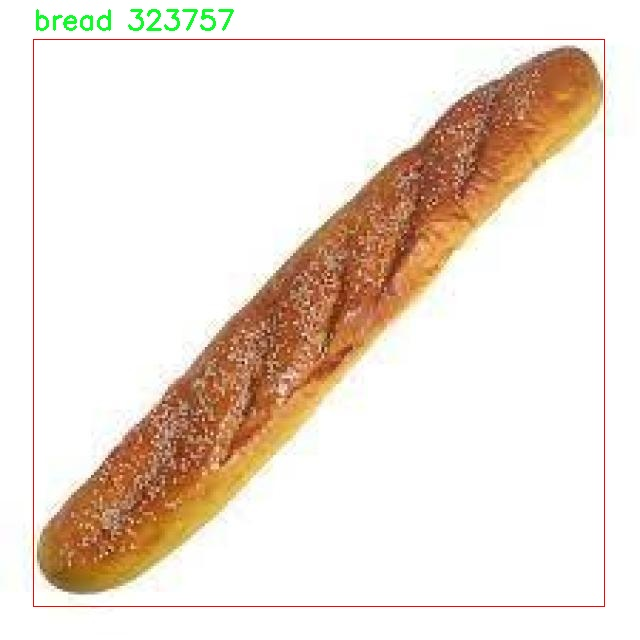

# 快餐食品检测系统源码分享
 # [一条龙教学YOLOV8标注好的数据集一键训练_70+全套改进创新点发刊_Web前端展示]

### 1.研究背景与意义

项目参考[AAAI Association for the Advancement of Artificial Intelligence](https://gitee.com/qunmasj/projects)

项目来源[AACV Association for the Advancement of Computer Vision](https://kdocs.cn/l/cszuIiCKVNis)

研究背景与意义

随着快餐行业的迅猛发展，消费者对食品质量和安全性的关注日益增强。快餐食品因其便捷性和多样性而受到广泛欢迎，但与此同时，快餐食品的种类繁多、制作过程复杂，导致其质量控制和食品安全管理面临诸多挑战。在这一背景下，基于计算机视觉技术的食品检测系统应运而生，成为提升快餐食品质量监控的重要手段。尤其是YOLO（You Only Look Once）系列模型，因其高效的实时目标检测能力，已被广泛应用于各类物体识别任务中。本文旨在探讨基于改进YOLOv8的快餐食品检测系统，借助于特定的数据集进行深入研究。

本研究所使用的数据集包含4700张图像，涵盖了10个不同的快餐食品类别，包括BBQ、汉堡饼、热狗、熟热狗、肉饼、牛肉饼、面包及其不同的外观特征（如红色底部、红色侧面和红色顶部）。这些类别的选择不仅反映了快餐食品的多样性，也为模型的训练提供了丰富的样本。通过对这些类别的深入分析，研究将有助于识别和检测快餐食品在制作和销售过程中的各种状态，从而为质量控制提供科学依据。

在快餐食品检测中，传统的人工检测方法不仅耗时耗力，而且容易受到人为因素的影响，导致检测结果的不稳定性。基于YOLOv8的快餐食品检测系统能够实现快速、准确的自动化检测，显著提高检测效率和准确性。通过改进YOLOv8模型，研究将探索如何优化模型的结构和参数设置，以适应快餐食品的特定特征，从而提升检测性能。此外，利用深度学习技术对图像进行特征提取和分类，可以有效降低对大量标注数据的依赖，进一步提高模型的泛化能力。

本研究的意义不仅在于推动快餐食品检测技术的发展，更在于为食品安全和质量管理提供创新的解决方案。通过建立高效的快餐食品检测系统，可以实时监控食品生产过程，及时发现潜在的质量问题，降低食品安全风险。同时，该系统还可以为快餐企业提供数据支持，帮助其优化生产流程、提升产品质量，从而增强市场竞争力。

综上所述，基于改进YOLOv8的快餐食品检测系统的研究具有重要的理论价值和实践意义。它不仅为快餐行业的智能化发展提供了新的思路，也为食品安全管理提供了有效的技术手段。未来，随着技术的不断进步和数据集的不断丰富，该系统有望在更广泛的应用场景中发挥作用，为消费者提供更加安全、健康的快餐食品。

### 2.图片演示







##### 注意：由于此博客编辑较早，上面“2.图片演示”和“3.视频演示”展示的系统图片或者视频可能为老版本，新版本在老版本的基础上升级如下：（实际效果以升级的新版本为准）

  （1）适配了YOLOV8的“目标检测”模型和“实例分割”模型，通过加载相应的权重（.pt）文件即可自适应加载模型。

  （2）支持“图片识别”、“视频识别”、“摄像头实时识别”三种识别模式。

  （3）支持“图片识别”、“视频识别”、“摄像头实时识别”三种识别结果保存导出，解决手动导出（容易卡顿出现爆内存）存在的问题，识别完自动保存结果并导出到tempDir中。

  （4）支持Web前端系统中的标题、背景图等自定义修改，后面提供修改教程。

  另外本项目提供训练的数据集和训练教程,暂不提供权重文件（best.pt）,需要您按照教程进行训练后实现图片演示和Web前端界面演示的效果。

### 3.视频演示

[3.1 视频演示](https://www.bilibili.com/video/BV1Rn2EYNEUn/)

### 4.数据集信息展示

##### 4.1 本项目数据集详细数据（类别数＆类别名）

nc: 6
names: ['bbq', 'bread', 'bun', 'hotdog', 'pattty', 'patty']


##### 4.2 本项目数据集信息介绍

数据集信息展示

在本研究中，我们使用了名为“burger detection”的数据集，以改进YOLOv8在快餐食品检测系统中的表现。该数据集专门针对快餐食品的多样性进行设计，涵盖了六个主要类别，分别是：bbq、bread、bun、hotdog、pattty和patty。这些类别的选择不仅反映了快餐食品的常见种类，还考虑到了它们在实际应用中的重要性，尤其是在餐饮行业的食品识别和分类任务中。

数据集的构建过程经过精心设计，确保每个类别的样本数量和质量都能满足深度学习模型训练的需求。每个类别都包含了丰富的图像数据，这些图像在不同的环境、光照条件和角度下拍摄，确保模型能够学习到足够的特征，以应对实际应用中的多样性和复杂性。例如，bbq类图像展示了各种烧烤食品的不同摆放方式，bread类则包含了多种面包的形态和纹理特征，bun类则聚焦于汉堡包的外观和结构。

在数据集的标注过程中，采用了严格的标准，以确保每个图像中的目标物体能够被准确识别和定位。通过使用边界框标注，数据集为每个类别提供了清晰的定位信息，这对于YOLOv8模型的训练至关重要。模型需要通过这些标注信息学习到如何在图像中快速而准确地识别和分类不同的快餐食品。这样的标注方式不仅提高了数据集的实用性，也为后续的模型评估和性能优化提供了可靠的基础。

为了增强数据集的多样性和鲁棒性，我们还对图像进行了多种数据增强处理，包括旋转、缩放、裁剪和颜色调整等。这些处理使得模型在训练过程中能够接触到更广泛的样本变异，从而提高其在真实场景中的泛化能力。此外，数据集还考虑到了不同文化和地区的快餐食品特点，使得模型在全球范围内的应用潜力得以提升。

在训练过程中，数据集的有效性将通过一系列指标进行评估，包括准确率、召回率和F1分数等。这些指标将帮助我们了解模型在不同类别上的表现，识别出潜在的改进方向。例如，某些类别如hotdog可能在特定环境下的识别率较低，这将促使我们进一步优化数据集，增加相关样本，以提升模型的整体性能。

综上所述，“burger detection”数据集不仅为YOLOv8的训练提供了丰富的图像数据和标注信息，还通过多样化的样本和严格的标注标准，确保了模型在快餐食品检测任务中的有效性和可靠性。通过不断优化和扩展该数据集，我们期望能够推动快餐食品检测技术的发展，为餐饮行业的智能化提供有力支持。











### 5.全套项目环境部署视频教程（零基础手把手教学）

[5.1 环境部署教程链接（零基础手把手教学）](https://www.ixigua.com/7404473917358506534?logTag=c807d0cbc21c0ef59de5)


[5.2 安装Python虚拟环境创建和依赖库安装视频教程链接（零基础手把手教学）](https://www.ixigua.com/7404474678003106304?logTag=1f1041108cd1f708b01a)

### 6.手把手YOLOV8训练视频教程（零基础小白有手就能学会）

[6.1 手把手YOLOV8训练视频教程（零基础小白有手就能学会）](https://www.ixigua.com/7404477157818401292?logTag=d31a2dfd1983c9668658)


按照上面的训练视频教程链接加载项目提供的数据集，运行train.py即可开始训练



     Epoch   gpu_mem       box       obj       cls    labels  img_size
     1/200     20.8G   0.01576   0.01955  0.007536        22      1280: 100%|██████████| 849/849 [14:42<00:00,  1.04s/it]
               Class     Images     Labels          P          R     mAP@.5 mAP@.5:.95: 100%|██████████| 213/213 [01:14<00:00,  2.87it/s]
                 all       3395      17314      0.994      0.957      0.0957      0.0843

     Epoch   gpu_mem       box       obj       cls    labels  img_size
     2/200     20.8G   0.01578   0.01923  0.007006        22      1280: 100%|██████████| 849/849 [14:44<00:00,  1.04s/it]
               Class     Images     Labels          P          R     mAP@.5 mAP@.5:.95: 100%|██████████| 213/213 [01:12<00:00,  2.95it/s]
                 all       3395      17314      0.996      0.956      0.0957      0.0845

     Epoch   gpu_mem       box       obj       cls    labels  img_size
     3/200     20.8G   0.01561    0.0191  0.006895        27      1280: 100%|██████████| 849/849 [10:56<00:00,  1.29it/s]
               Class     Images     Labels          P          R     mAP@.5 mAP@.5:.95: 100%|███████   | 187/213 [00:52<00:00,  4.04it/s]
                 all       3395      17314      0.996      0.957      0.0957      0.0845


### 7.70+种全套YOLOV8创新点代码加载调参视频教程（一键加载写好的改进模型的配置文件）

[7.1 70+种全套YOLOV8创新点代码加载调参视频教程（一键加载写好的改进模型的配置文件）](https://www.ixigua.com/7404478314661806627?logTag=29066f8288e3f4eea3a4)

### 8.70+种全套YOLOV8创新点原理讲解（非科班也可以轻松写刊发刊，V10版本正在科研待更新）

#### 由于篇幅限制，每个创新点的具体原理讲解就不一一展开，具体见下列网址中的创新点对应子项目的技术原理博客网址【Blog】：


[8.1 70+种全套YOLOV8创新点原理讲解链接](https://gitee.com/qunmasj/good)

#### 部分改进原理讲解(完整的改进原理见上图和技术博客链接)
### YOLOv8简介
#### Backbone


借鉴了其他算法的这些设计思想

借鉴了VGG的思想，使用了较多的3×3卷积，在每一次池化操作后，将通道数翻倍；

借鉴了network in network的思想，使用全局平均池化（global average pooling）做预测，并把1×1的卷积核置于3×3的卷积核之间，用来压缩特征；（我没找到这一步体现在哪里）

使用了批归一化层稳定模型训练，加速收敛，并且起到正则化作用。

    以上三点为Darknet19借鉴其他模型的点。Darknet53当然是在继承了Darknet19的这些优点的基础上再新增了下面这些优点的。因此列在了这里

借鉴了ResNet的思想，在网络中大量使用了残差连接，因此网络结构可以设计的很深，并且缓解了训练中梯度消失的问题，使得模型更容易收敛。

使用步长为2的卷积层代替池化层实现降采样。（这一点在经典的Darknet-53上是很明显的，output的长和宽从256降到128，再降低到64，一路降低到8，应该是通过步长为2的卷积层实现的；在YOLOv8的卷积层中也有体现，比如图中我标出的这些位置）

#### 特征融合

模型架构图如下

  Darknet-53的特点可以这样概括：（Conv卷积模块+Residual Block残差块）串行叠加4次

  Conv卷积层+Residual Block残差网络就被称为一个stage


上面红色指出的那个，原始的Darknet-53里面有一层 卷积，在YOLOv8里面，把一层卷积移除了

为什么移除呢？

        原始Darknet-53模型中间加的这个卷积层做了什么？滤波器（卷积核）的个数从 上一个卷积层的512个，先增加到1024个卷积核，然后下一层卷积的卷积核的个数又降低到512个

        移除掉这一层以后，少了1024个卷积核，就可以少做1024次卷积运算，同时也少了1024个3×3的卷积核的参数，也就是少了9×1024个参数需要拟合。这样可以大大减少了模型的参数，（相当于做了轻量化吧）

        移除掉这个卷积层，可能是因为作者发现移除掉这个卷积层以后，模型的score有所提升，所以才移除掉的。为什么移除掉以后，分数有所提高呢？可能是因为多了这些参数就容易，参数过多导致模型在训练集删过拟合，但是在测试集上表现很差，最终模型的分数比较低。你移除掉这个卷积层以后，参数减少了，过拟合现象不那么严重了，泛化能力增强了。当然这个是，拿着你做实验的结论，反过来再找补，再去强行解释这种现象的合理性。

过拟合


通过MMdetection官方绘制册这个图我们可以看到，进来的这张图片经过一个“Feature Pyramid Network(简称FPN)”，然后最后的P3、P4、P5传递给下一层的Neck和Head去做识别任务。 PAN（Path Aggregation Network）


“FPN是自顶向下，将高层的强语义特征传递下来。PAN就是在FPN的后面添加一个自底向上的金字塔，对FPN补充，将低层的强定位特征传递上去，

FPN是自顶（小尺寸，卷积次数多得到的结果，语义信息丰富）向下（大尺寸，卷积次数少得到的结果），将高层的强语义特征传递下来，对整个金字塔进行增强，不过只增强了语义信息，对定位信息没有传递。PAN就是针对这一点，在FPN的后面添加一个自底（卷积次数少，大尺寸）向上（卷积次数多，小尺寸，语义信息丰富）的金字塔，对FPN补充，将低层的强定位特征传递上去，又被称之为“双塔战术”。

FPN层自顶向下传达强语义特征，而特征金字塔则自底向上传达强定位特征，两两联手，从不同的主干层对不同的检测层进行参数聚合,这样的操作确实很皮。
#### 自底向上增强

而 PAN（Path Aggregation Network）是对 FPN 的一种改进，它的设计理念是在 FPN 后面添加一个自底向上的金字塔。PAN 引入了路径聚合的方式，通过将浅层特征图（低分辨率但语义信息较弱）和深层特征图（高分辨率但语义信息丰富）进行聚合，并沿着特定的路径传递特征信息，将低层的强定位特征传递上去。这样的操作能够进一步增强多尺度特征的表达能力，使得 PAN 在目标检测任务中表现更加优秀。


### 可重参化EfficientRepBiPAN优化Neck
#### Repvgg-style
Repvgg-style的卷积层包含
卷积+ReLU结构，该结构能够有效地利用硬件资源。

在训练时，Repvgg-style的卷积层包含
卷积、
卷积、identity。（下图左图）


在推理时，通过重参数化（re-parameterization），上述的多分支结构可以转换为单分支的
卷积。（下图右图）


基于上述思想，作者设计了对GPU硬件友好的EfficientRep Backbone和Rep-PAN Neck，将它们用于YOLOv6中。

EfficientRep Backbone的结构图：


Rep-PAN Neck结构图：


#### Multi-path
只使用repvgg-style不能达到很好的精度-速度平衡，对于大模型，作者探索了多路径的网络结构。

参考该博客提出了Bep unit，其结构如下图所示：


CSP（Cross Stage Partial）-style计算量小，且有丰富的梯度融合信息，广泛应用于YOLO系列中，比如YOLOv5、PPYOLOE。

作者将Bep unit与CSP-style结合，设计了一种新的网络结构BepC3，如下图所示：


基于BepC3模块，作者设计了新的CSPBep Backbone和CSPRepPAN Neck，以达到很好的精度-速度平衡。

其他YOLO系列在使用CSP-stype结构时，partial ratio设置为1/2。为了达到更好的性能，在YOLOv6m中partial ratio的值为2/3，在YOLOv6l中partial ratio的值为1/2。

对于YOLOv6m，单纯使用Rep-style结构和使用BepC3结构的对比如下图所示：

#### BIFPN
BiFPN 全称 Bidirectional Feature Pyramid Network 加权双向（自顶向下 + 自低向上）特征金字塔网络。

相比较于PANet，BiFPN在设计上的改变：

总结下图：
图d 蓝色部分为自顶向下的通路，传递的是高层特征的语义信息；红色部分是自底向上的通路，传递的是低层特征的位置信息；紫色部分是上述第二点提到的同一层在输入节点和输入节点间新加的一条边。


我们删除那些只有一条输入边的节点。这么做的思路很简单：如果一个节点只有一条输入边而没有特征融合，那么它对旨在融合不同特征的特征网络的贡献就会很小。删除它对我们的网络影响不大，同时简化了双向网络；如上图d 的 P7右边第一个节点

如果原始输入节点和输出节点处于同一层，我们会在原始输入节点和输出节点之间添加一条额外的边。思路：以在不增加太多成本的情况下融合更多的特性；

与只有一个自顶向下和一个自底向上路径的PANet不同，我们处理每个双向路径(自顶向下和自底而上)路径作为一个特征网络层，并重复同一层多次，以实现更高层次的特征融合。如下图EfficientNet 的网络结构所示，我们对BiFPN是重复使用多次的。而这个使用次数也不是我们认为设定的，而是作为参数一起加入网络的设计当中，使用NAS技术算出来的。


Weighted Feature Fusion 带权特征融合：学习不同输入特征的重要性，对不同输入特征有区分的融合。
设计思路：传统的特征融合往往只是简单的 feature map 叠加/相加 (sum them up)，比如使用concat或者shortcut连接，而不对同时加进来的 feature map 进行区分。然而，不同的输入 feature map 具有不同的分辨率，它们对融合输入 feature map 的贡献也是不同的，因此简单的对他们进行相加或叠加处理并不是最佳的操作。所以这里我们提出了一种简单而高效的加权特融合的机制。
常见的带权特征融合有三种方法，分别是：


​
  这种方法比较简单，直接加一个可学习的权重。但是由于这个权重不受限制，所有可能引起训练的不稳定，所有并不推荐。
Softmax-based fusion: O = ∑ i e w i ∗ I i ϵ + ∑ j e w j O = \sum_{i} \frac{e^{w_i} * I_i}{ \epsilon+\sum_{j}e^{w_j}}O=∑ 

 

​
  使用这种方法可以将范围放缩到 [ 0 , 1 ] [0, 1][0,1] 之间，训练稳定，但是训练很慢，所有也不推荐。
Fast normalized fusion: O = ∑ i w i ∗ I i ϵ + ∑ j w j O = \sum_{i} \frac{w_i * I_i}{ \epsilon+\sum_{j}w_j}O=∑ 


### 9.系统功能展示（检测对象为举例，实际内容以本项目数据集为准）

图9.1.系统支持检测结果表格显示

  图9.2.系统支持置信度和IOU阈值手动调节

  图9.3.系统支持自定义加载权重文件best.pt(需要你通过步骤5中训练获得)

  图9.4.系统支持摄像头实时识别

  图9.5.系统支持图片识别

  图9.6.系统支持视频识别

  图9.7.系统支持识别结果文件自动保存

  图9.8.系统支持Excel导出检测结果数据


### 10.原始YOLOV8算法原理

原始YOLOv8算法原理

YOLOv8算法是目标检测领域的最新进展，作为YOLO系列的第八个版本，它在前期版本的基础上进行了多项创新和改进，旨在提升检测精度和速度。YOLOv8的网络结构依然由输入层、主干网络、特征融合层和解耦头组成，保持了YOLO系列一贯的高效性和实用性。尽管YOLOv8的论文尚未正式发表，但其在目标检测领域的影响力已经显现。

在YOLOv8的主干网络中，采用了CSPDarknet的设计理念，继续使用YOLOv5的架构。与YOLOv5不同的是，YOLOv8将C3模块替换为C2f模块，这一改动不仅实现了模型的轻量化，同时也确保了检测精度的保持。C2f模块的设计灵感来源于YOLOv7的ELAN结构，它通过引入多个shortcut连接来缓解深层网络中的梯度消失问题，增强了特征的重用能力。C2f模块包含三个CBS（卷积+归一化+SiLU激活函数）模块和多个Bottleneck结构，通过这种方式，YOLOv8能够提取更丰富的特征信息，从而提高目标检测的准确性。

在特征融合层，YOLOv8采用了PAN-FPN（Path Aggregation Network - Feature Pyramid Network）结构。这一结构能够有效地融合不同层次的特征，促进了多尺度信息的充分利用。YOLOv8在此基础上对上采样阶段进行了优化，去除了YOLOv5中1x1卷积的使用，使得特征融合过程更加高效。通过将高层特征与中层特征和浅层特征进行深度融合，YOLOv8能够在不同尺度上更好地捕捉目标信息，从而提升检测性能。

YOLOv8的一个显著创新是采用了Anchor-Free的目标检测思想，摒弃了传统的Anchor-Based方法。这一转变使得YOLOv8在处理不同尺寸和形状的目标时更加灵活，减少了对先验框的依赖，从而简化了模型的设计和训练过程。通过这种方式，YOLOv8能够更好地适应复杂的场景，提高了检测的准确性和鲁棒性。

在损失函数的设计上，YOLOv8引入了VFLLoss作为分类损失，并结合DFLLoss和CIoULoss作为回归损失。这种多损失函数的组合不仅提升了模型的学习能力，还有效地解决了样本不平衡的问题，尤其是在目标较小或占比极低的情况下。通过调整损失函数的权重，YOLOv8能够更好地聚焦于难以分类的样本，从而提高整体的检测性能。

样本匹配策略方面，YOLOv8采用了Task-Aligned的Assigner匹配方式，取代了传统的静态匹配。这一改进使得模型在训练过程中能够更灵活地适应不同的任务需求，从而提高了训练效率和模型的泛化能力。

在数据预处理阶段，YOLOv8延续了YOLOv5的策略，采用了多种数据增强技术，如马赛克增强、混合增强、空间扰动和颜色扰动等。这些增强手段的使用，不仅丰富了训练数据集，还提高了模型对不同场景的适应能力，进一步提升了检测精度。

YOLOv8的Head部分借鉴了YOLOX和YOLOv6的解耦头设计，取消了objectness分支，通过边框回归和目标分类的分离，显著加快了模型的收敛速度。Head部分的输出特征图经过处理后，能够有效地进行目标分类和边框回归，确保了检测结果的准确性。

综上所述，YOLOv8算法通过一系列的创新和改进，进一步提升了目标检测的性能。其在主干网络、特征融合、损失函数、样本匹配和数据预处理等多个方面的优化，使得YOLOv8在实时检测任务中展现出更高的精度和速度。作为YOLO系列的最新版本，YOLOv8无疑为目标检测领域带来了新的冲击和机遇，推动了这一领域的持续发展。


### 11.项目核心源码讲解（再也不用担心看不懂代码逻辑）

#### 11.1 ui.py

以下是经过简化和注释的核心代码部分：

```python
import sys
import subprocess
from QtFusion.path import abs_path

def run_script(script_path):
    """
    使用当前 Python 环境运行指定的脚本。

    Args:
        script_path (str): 要运行的脚本路径
    """
    # 获取当前 Python 解释器的路径
    python_path = sys.executable

    # 构建运行命令，使用 streamlit 运行指定的脚本
    command = f'"{python_path}" -m streamlit run "{script_path}"'

    # 执行命令并等待其完成
    result = subprocess.run(command, shell=True)
    
    # 检查命令执行结果，如果返回码不为0，则表示出错
    if result.returncode != 0:
        print("脚本运行出错。")

# 主程序入口
if __name__ == "__main__":
    # 获取脚本的绝对路径
    script_path = abs_path("web.py")

    # 运行指定的脚本
    run_script(script_path)
```

### 代码分析与注释：
1. **导入模块**：
   - `sys`：用于访问与 Python 解释器相关的变量和函数。
   - `subprocess`：用于执行外部命令。
   - `abs_path`：从 `QtFusion.path` 模块导入的函数，用于获取文件的绝对路径。

2. **`run_script` 函数**：
   - 功能：运行指定的 Python 脚本。
   - 参数：`script_path` 是要运行的脚本的路径。
   - 使用 `sys.executable` 获取当前 Python 解释器的路径。
   - 构建一个命令字符串，使用 `streamlit` 运行指定的脚本。
   - 使用 `subprocess.run` 执行命令，并等待其完成。
   - 检查命令的返回码，如果不为0，表示脚本运行出错，打印错误信息。

3. **主程序入口**：
   - 检查是否为主模块执行，如果是，则获取 `web.py` 的绝对路径并调用 `run_script` 函数运行该脚本。

这个文件名为 `ui.py`，它的主要功能是通过当前的 Python 环境来运行一个指定的脚本，具体是一个名为 `web.py` 的文件。文件中首先导入了必要的模块，包括 `sys`、`os` 和 `subprocess`，以及一个自定义的 `abs_path` 函数，这个函数可能用于获取文件的绝对路径。

在 `run_script` 函数中，首先获取当前 Python 解释器的路径，这样可以确保在正确的环境中运行脚本。接着，构建一个命令字符串，该命令使用 `streamlit` 模块来运行指定的脚本。`streamlit` 是一个用于构建数据应用的库，因此这里的 `web.py` 可能是一个用 `streamlit` 编写的应用。

使用 `subprocess.run` 方法来执行构建的命令，并通过 `shell=True` 参数在 shell 中运行该命令。运行后，检查返回的结果，如果返回码不为 0，表示脚本运行过程中出现了错误，程序会打印出相应的错误信息。

在文件的最后部分，使用 `if __name__ == "__main__":` 来确保只有在直接运行该文件时才会执行后面的代码。这里指定了要运行的脚本路径为 `web.py`，并调用 `run_script` 函数来执行它。

总体来说，这个文件的作用是作为一个启动器，方便用户通过命令行来运行一个基于 `streamlit` 的 Python 脚本。

#### 11.2 code\ultralytics\utils\plotting.py

以下是经过简化并注释的核心代码部分，主要集中在 `Colors` 和 `Annotator` 类上：

```python
import numpy as np
from PIL import Image, ImageDraw, ImageFont
import cv2

class Colors:
    """
    颜色类，用于处理颜色调色板，包括将十六进制颜色代码转换为RGB值。
    """

    def __init__(self):
        """初始化颜色调色板，定义了一组十六进制颜色。"""
        hexs = (
            "FF3838", "FF9D97", "FF701F", "FFB21D", "CFD231",
            "48F90A", "92CC17", "3DDB86", "1A9334", "00D4BB",
            "2C99A8", "00C2FF", "344593", "6473FF", "0018EC",
            "8438FF", "520085", "CB38FF", "FF95C8", "FF37C7",
        )
        # 将十六进制颜色转换为RGB格式并存储
        self.palette = [self.hex2rgb(f"#{c}") for c in hexs]
        self.n = len(self.palette)  # 颜色数量

    def __call__(self, i, bgr=False):
        """根据索引返回颜色，支持BGR格式转换。"""
        c = self.palette[int(i) % self.n]  # 获取颜色
        return (c[2], c[1], c[0]) if bgr else c  # 如果需要BGR格式则返回BGR

    @staticmethod
    def hex2rgb(h):
        """将十六进制颜色代码转换为RGB值。"""
        return tuple(int(h[1 + i : 1 + i + 2], 16) for i in (0, 2, 4))


class Annotator:
    """
    注释类，用于在图像上绘制边框、文本和关键点。
    """

    def __init__(self, im, line_width=None, font_size=None, font="Arial.ttf", pil=False):
        """初始化Annotator类，设置图像、线宽和字体。"""
        self.im = im if isinstance(im, Image.Image) else Image.fromarray(im)  # 确保图像为PIL格式
        self.draw = ImageDraw.Draw(self.im)  # 创建绘图对象
        self.lw = line_width or 2  # 设置线宽，默认为2
        self.font = ImageFont.load_default()  # 加载默认字体

    def box_label(self, box, label="", color=(128, 128, 128), txt_color=(255, 255, 255)):
        """在图像上绘制一个边框和标签。"""
        # 绘制矩形框
        self.draw.rectangle(box, width=self.lw, outline=color)
        if label:
            # 获取文本大小并绘制背景矩形
            w, h = self.draw.textsize(label, font=self.font)
            self.draw.rectangle((box[0], box[1] - h, box[0] + w, box[1]), fill=color)
            # 绘制文本
            self.draw.text((box[0], box[1] - h), label, fill=txt_color, font=self.font)

    def result(self):
        """返回注释后的图像。"""
        return np.asarray(self.im)  # 将PIL图像转换为numpy数组
```

### 代码注释说明
1. **Colors 类**:
   - 用于管理颜色调色板，提供了将十六进制颜色转换为RGB格式的功能。
   - `__call__` 方法允许通过索引直接获取颜色，并支持BGR格式转换。

2. **Annotator 类**:
   - 负责在图像上绘制边框、文本和关键点。
   - `box_label` 方法用于绘制矩形框及其标签，支持自定义颜色和文本颜色。

以上代码展示了如何使用Python进行图像注释的基本功能，适用于目标检测等计算机视觉任务。

这个程序文件是一个用于图像处理和可视化的工具库，主要用于Ultralytics YOLO（You Only Look Once）目标检测模型的结果展示和图像标注。文件中包含多个类和函数，提供了丰富的功能以支持图像的注释、绘制、保存和结果可视化。

首先，文件定义了一个`Colors`类，用于管理颜色调色板。该类可以将十六进制颜色代码转换为RGB值，并提供了一组默认的颜色供后续使用。`__init__`方法中定义了一些常用的颜色，并将其转换为RGB格式。

接下来是`Annotator`类，它负责在图像上绘制各种注释，包括边界框、关键点、文本等。该类的构造函数接受图像、线宽、字体等参数，并根据使用的绘图库（PIL或OpenCV）初始化相应的绘制工具。`Annotator`类还定义了多种方法，如`box_label`用于绘制边界框和标签，`masks`用于绘制分割掩码，`kpts`用于绘制关键点等。

在绘制过程中，`Annotator`类能够处理旋转的边界框、透明度、文本框样式等多种特性，确保绘制的结果美观且易于理解。它还支持绘制特定的关键点和连接线，以便于可视化人体姿态等信息。

此外，文件中还包含多个函数，例如`plot_labels`用于绘制训练标签的统计信息，`save_one_box`用于保存图像中的特定区域，`plot_images`用于绘制图像网格并添加标签，`plot_results`用于从CSV文件中绘制训练结果等。这些函数通过不同的参数和设置，允许用户灵活地进行图像的可视化和分析。

文件还实现了一些用于处理模型输出的函数，如`output_to_target`和`output_to_rotated_target`，这些函数将模型的输出转换为适合绘制的格式，以便于后续的可视化。

总的来说，这个程序文件提供了一整套用于图像注释和结果可视化的工具，适用于计算机视觉领域，尤其是在目标检测和姿态估计等任务中，帮助用户更好地理解和分析模型的输出结果。

#### 11.3 code\ultralytics\models\yolo\pose\__init__.py

以下是经过简化并添加详细中文注释的核心代码部分：

```python
# 导入必要的模块
from .predict import PosePredictor  # 导入姿态预测器
from .train import PoseTrainer      # 导入姿态训练器
from .val import PoseValidator      # 导入姿态验证器

# 定义模块的公开接口，只有这些类可以被外部访问
__all__ = "PoseTrainer", "PoseValidator", "PosePredictor"
```

### 代码注释说明：
1. **导入模块**：
   - `from .predict import PosePredictor`：从当前包的 `predict` 模块中导入 `PosePredictor` 类，负责姿态预测的功能。
   - `from .train import PoseTrainer`：从当前包的 `train` 模块中导入 `PoseTrainer` 类，负责模型的训练过程。
   - `from .val import PoseValidator`：从当前包的 `val` 模块中导入 `PoseValidator` 类，负责模型验证的功能。

2. **定义公开接口**：
   - `__all__` 是一个特殊变量，用于定义当使用 `from module import *` 时，哪些类或函数是可以被导入的。在这里，只有 `PoseTrainer`、`PoseValidator` 和 `PosePredictor` 这三个类会被公开，其他未列出的类或函数将不会被导入。这样可以控制模块的可见性，避免不必要的命名冲突。

这个程序文件是Ultralytics YOLO项目中的一个初始化文件，通常用于定义模块的公共接口。在这个文件中，首先通过注释标明了项目的名称和许可证类型，表明该项目是Ultralytics YOLO，并且遵循AGPL-3.0许可证。

接下来，文件导入了三个类：`PosePredictor`、`PoseTrainer`和`PoseValidator`。这些类分别来自于同一目录下的`predict.py`、`train.py`和`val.py`文件。通过导入这些类，文件为用户提供了一个统一的接口，以便在其他模块中使用这些功能。

最后，`__all__`变量被定义为一个元组，包含了这三个类的名称。这意味着当使用`from module import *`语句时，只会导入`PoseTrainer`、`PoseValidator`和`PosePredictor`这三个类，而不会导入其他未列出的内容。这种做法有助于控制模块的公共接口，避免不必要的命名冲突或不希望被外部访问的内部实现细节。

总的来说，这个初始化文件的主要作用是组织和简化模块的导入，使得使用者能够方便地访问与姿态估计相关的功能。

#### 11.4 train.py

以下是代码中最核心的部分，并附上详细的中文注释：

```python
class DetectionTrainer(BaseTrainer):
    """
    DetectionTrainer类，继承自BaseTrainer类，用于基于检测模型的训练。
    """

    def build_dataset(self, img_path, mode="train", batch=None):
        """
        构建YOLO数据集。

        参数:
            img_path (str): 包含图像的文件夹路径。
            mode (str): 模式，`train`表示训练模式，`val`表示验证模式，用户可以为每种模式自定义不同的增强。
            batch (int, optional): 批次大小，仅用于`rect`模式。默认为None。
        """
        gs = max(int(de_parallel(self.model).stride.max() if self.model else 0), 32)
        return build_yolo_dataset(self.args, img_path, batch, self.data, mode=mode, rect=mode == "val", stride=gs)

    def get_dataloader(self, dataset_path, batch_size=16, rank=0, mode="train"):
        """构造并返回数据加载器。"""
        assert mode in ["train", "val"]  # 确保模式为训练或验证
        with torch_distributed_zero_first(rank):  # 如果使用分布式数据并行，确保只初始化一次数据集
            dataset = self.build_dataset(dataset_path, mode, batch_size)
        shuffle = mode == "train"  # 训练模式下打乱数据
        if getattr(dataset, "rect", False) and shuffle:
            LOGGER.warning("WARNING ⚠️ 'rect=True'与DataLoader的shuffle不兼容，设置shuffle=False")
            shuffle = False
        workers = self.args.workers if mode == "train" else self.args.workers * 2  # 根据模式设置工作线程数
        return build_dataloader(dataset, batch_size, workers, shuffle, rank)  # 返回数据加载器

    def preprocess_batch(self, batch):
        """对一批图像进行预处理，包括缩放和转换为浮点数。"""
        batch["img"] = batch["img"].to(self.device, non_blocking=True).float() / 255  # 将图像转换为浮点数并归一化
        if self.args.multi_scale:  # 如果启用多尺度
            imgs = batch["img"]
            sz = (
                random.randrange(self.args.imgsz * 0.5, self.args.imgsz * 1.5 + self.stride)
                // self.stride
                * self.stride
            )  # 随机选择新的尺寸
            sf = sz / max(imgs.shape[2:])  # 计算缩放因子
            if sf != 1:
                ns = [
                    math.ceil(x * sf / self.stride) * self.stride for x in imgs.shape[2:]
                ]  # 计算新的形状
                imgs = nn.functional.interpolate(imgs, size=ns, mode="bilinear", align_corners=False)  # 进行插值
            batch["img"] = imgs  # 更新批次中的图像
        return batch

    def get_model(self, cfg=None, weights=None, verbose=True):
        """返回YOLO检测模型。"""
        model = DetectionModel(cfg, nc=self.data["nc"], verbose=verbose and RANK == -1)  # 创建检测模型
        if weights:
            model.load(weights)  # 加载权重
        return model

    def get_validator(self):
        """返回用于YOLO模型验证的DetectionValidator。"""
        self.loss_names = "box_loss", "cls_loss", "dfl_loss"  # 定义损失名称
        return yolo.detect.DetectionValidator(
            self.test_loader, save_dir=self.save_dir, args=copy(self.args), _callbacks=self.callbacks
        )  # 返回验证器

    def plot_training_samples(self, batch, ni):
        """绘制带有注释的训练样本。"""
        plot_images(
            images=batch["img"],
            batch_idx=batch["batch_idx"],
            cls=batch["cls"].squeeze(-1),
            bboxes=batch["bboxes"],
            paths=batch["im_file"],
            fname=self.save_dir / f"train_batch{ni}.jpg",
            on_plot=self.on_plot,
        )  # 绘制图像

    def plot_metrics(self):
        """从CSV文件中绘制指标。"""
        plot_results(file=self.csv, on_plot=self.on_plot)  # 保存结果图
```

### 代码说明
1. **DetectionTrainer类**：这是一个用于训练YOLO检测模型的类，继承自`BaseTrainer`。
2. **build_dataset方法**：用于构建YOLO数据集，支持训练和验证模式，并允许用户自定义数据增强。
3. **get_dataloader方法**：构造数据加载器，支持分布式训练，确保数据在训练模式下打乱。
4. **preprocess_batch方法**：对输入的图像批次进行预处理，包括归一化和多尺度调整。
5. **get_model方法**：创建并返回YOLO检测模型，可以选择加载预训练权重。
6. **get_validator方法**：返回用于模型验证的验证器，记录损失名称。
7. **plot_training_samples方法**：绘制训练样本及其注释，便于可视化训练过程。
8. **plot_metrics方法**：从CSV文件中绘制训练指标，便于监控训练效果。

这个程序文件 `train.py` 是一个用于训练 YOLO（You Only Look Once）目标检测模型的实现，继承自 `BaseTrainer` 类。它主要包含数据集构建、数据加载、模型设置、训练过程中的损失计算和可视化等功能。

首先，程序导入了一些必要的库和模块，包括数学运算、随机数生成、深度学习框架 PyTorch 的神经网络模块，以及一些与 YOLO 相关的工具和数据处理函数。

`DetectionTrainer` 类是这个文件的核心，负责管理训练过程。它提供了多个方法来构建数据集、获取数据加载器、预处理图像批次、设置模型属性、获取模型、验证模型、计算损失、显示训练进度、绘制训练样本和绘制训练指标等。

在 `build_dataset` 方法中，程序根据给定的图像路径和模式（训练或验证）构建 YOLO 数据集。它使用 `build_yolo_dataset` 函数来创建数据集，支持不同的增强方式。

`get_dataloader` 方法则用于构建数据加载器，确保在分布式训练时只初始化一次数据集。它根据训练或验证模式设置数据加载的参数，并返回一个数据加载器。

`preprocess_batch` 方法负责对图像批次进行预处理，包括将图像缩放到合适的大小并转换为浮点数格式。它还支持多尺度训练，通过随机选择图像大小来增强模型的鲁棒性。

`set_model_attributes` 方法用于设置模型的属性，包括类别数量和类别名称等。这些属性对于模型的训练和评估至关重要。

`get_model` 方法返回一个 YOLO 检测模型，并可以加载预训练权重。`get_validator` 方法则返回一个用于验证模型性能的验证器。

在训练过程中，`label_loss_items` 方法用于返回带有标签的损失字典，便于监控训练过程中的损失变化。`progress_string` 方法格式化训练进度信息，包括当前的 epoch、GPU 内存使用情况和损失值等。

此外，程序还提供了绘制训练样本和训练指标的功能。`plot_training_samples` 方法用于可视化训练样本及其标注，而 `plot_metrics` 和 `plot_training_labels` 方法则用于绘制训练过程中的指标和标签信息。

总体而言，这个文件实现了 YOLO 模型训练的各个方面，涵盖了数据处理、模型构建、训练监控和结果可视化等功能，为目标检测任务提供了一个完整的训练框架。

#### 11.5 code\ultralytics\models\sam\modules\__init__.py

```python
# Ultralytics YOLO 🚀, AGPL-3.0 license

# 该代码是YOLO（You Only Look Once）模型的核心部分，YOLO是一种用于目标检测的深度学习模型。
# Ultralytics是YOLO模型的一个实现版本，遵循AGPL-3.0许可证。

# 下面是YOLO模型的基本结构和功能的简要说明。

# 1. 导入必要的库
import torch  # 导入PyTorch库，用于深度学习模型的构建和训练

# 2. 定义YOLO模型类
class YOLO:
    def __init__(self, model_path):
        # 初始化YOLO模型
        self.model = torch.load(model_path)  # 加载预训练模型

    def predict(self, image):
        # 对输入图像进行预测
        with torch.no_grad():  # 禁用梯度计算以节省内存
            predictions = self.model(image)  # 使用模型进行预测
        return predictions  # 返回预测结果

# 3. 使用YOLO模型进行目标检测
if __name__ == "__main__":
    yolo_model = YOLO('path/to/model.pt')  # 创建YOLO模型实例并加载模型
    image = torch.randn(1, 3, 640, 640)  # 创建一个随机图像作为输入
    results = yolo_model.predict(image)  # 进行预测
    print(results)  # 输出预测结果
```

### 代码注释说明：
- 该代码实现了YOLO模型的基本结构，包括模型的初始化和预测功能。
- 使用`torch`库来处理深度学习模型的加载和推理。
- `YOLO`类的构造函数接受一个模型路径，加载预训练的YOLO模型。
- `predict`方法用于对输入图像进行目标检测，返回预测结果。
- 在主程序中，创建了YOLO模型的实例，并对一张随机生成的图像进行了预测，最后输出了预测结果。

这个文件是Ultralytics YOLO项目的一部分，主要用于深度学习目标检测模型的实现。文件的开头包含了一行注释，表明该项目遵循AGPL-3.0许可证，这是一种开源许可证，允许用户自由使用、修改和分发软件，但要求任何分发的修改版本也必须在相同的许可证下发布。

由于文件内容较少，仅包含这一行注释，因此它的主要作用可能是作为模块的初始化文件。通常，在Python中，`__init__.py`文件用于标识一个目录是一个包，并可以在其中定义包的公共接口或初始化包的状态。

在Ultralytics YOLO项目中，这个文件可能会被用来导入其他模块或类，或者设置一些包级别的配置。虽然具体的实现细节在这段代码中并未体现，但它是整个模型架构的一部分，帮助组织和管理代码结构。

#### 11.6 70+种YOLOv8算法改进源码大全和调试加载训练教程（非必要）\ultralytics\models\sam\predict.py

以下是经过简化和注释的核心代码部分，主要集中在`Predictor`类及其重要方法上：

```python
import numpy as np
import torch
import torch.nn.functional as F
import torchvision

from ultralytics.data.augment import LetterBox
from ultralytics.engine.predictor import BasePredictor
from ultralytics.engine.results import Results
from ultralytics.utils import ops
from ultralytics.utils.torch_utils import select_device

class Predictor(BasePredictor):
    """
    Predictor类用于Segment Anything Model (SAM)的推理，扩展自BasePredictor。
    提供图像分割任务的推理接口，支持多种提示类型，如边界框、点和低分辨率掩码。
    """

    def __init__(self, cfg=DEFAULT_CFG, overrides=None, _callbacks=None):
        """
        初始化Predictor，设置配置、覆盖和回调。
        """
        if overrides is None:
            overrides = {}
        overrides.update(dict(task='segment', mode='predict', imgsz=1024))
        super().__init__(cfg, overrides, _callbacks)
        self.args.retina_masks = True  # 启用视网膜掩码
        self.im = None  # 输入图像
        self.features = None  # 提取的图像特征
        self.prompts = {}  # 存储提示信息
        self.segment_all = False  # 控制是否分割所有对象

    def preprocess(self, im):
        """
        预处理输入图像以进行模型推理。
        支持torch.Tensor和np.ndarray格式的输入。
        """
        if self.im is not None:
            return self.im  # 如果已经处理过，直接返回
        not_tensor = not isinstance(im, torch.Tensor)
        if not_tensor:
            im = np.stack(self.pre_transform(im))  # 转换为张量
            im = im[..., ::-1].transpose((0, 3, 1, 2))  # 颜色通道转换
            im = np.ascontiguousarray(im)
            im = torch.from_numpy(im)

        im = im.to(self.device)  # 转移到指定设备
        im = im.half() if self.model.fp16 else im.float()  # 转换为半精度或单精度
        if not_tensor:
            im = (im - self.mean) / self.std  # 归一化
        return im

    def inference(self, im, bboxes=None, points=None, labels=None, masks=None, multimask_output=False, *args, **kwargs):
        """
        基于给定提示进行图像分割推理。
        """
        # 如果有存储的提示，则覆盖输入的提示
        bboxes = self.prompts.pop('bboxes', bboxes)
        points = self.prompts.pop('points', points)
        masks = self.prompts.pop('masks', masks)

        if all(i is None for i in [bboxes, points, masks]):
            return self.generate(im, *args, **kwargs)  # 如果没有提示，生成掩码

        return self.prompt_inference(im, bboxes, points, labels, masks, multimask_output)  # 使用提示进行推理

    def prompt_inference(self, im, bboxes=None, points=None, labels=None, masks=None, multimask_output=False):
        """
        使用提示（如边界框、点和掩码）进行图像分割推理。
        """
        features = self.model.image_encoder(im) if self.features is None else self.features  # 提取图像特征

        # 处理输入提示
        if points is not None:
            points = torch.as_tensor(points, dtype=torch.float32, device=self.device)
            points = points[None] if points.ndim == 1 else points
            if labels is None:
                labels = np.ones(points.shape[0])  # 默认标签为前景
            labels = torch.as_tensor(labels, dtype=torch.int32, device=self.device)
        if bboxes is not None:
            bboxes = torch.as_tensor(bboxes, dtype=torch.float32, device=self.device)

        # 嵌入提示并预测掩码
        sparse_embeddings, dense_embeddings = self.model.prompt_encoder(points=points, boxes=bboxes, masks=masks)
        pred_masks, pred_scores = self.model.mask_decoder(
            image_embeddings=features,
            sparse_prompt_embeddings=sparse_embeddings,
            dense_prompt_embeddings=dense_embeddings,
            multimask_output=multimask_output,
        )

        return pred_masks.flatten(0, 1), pred_scores.flatten(0, 1)  # 返回预测的掩码和分数

    def generate(self, im, crop_n_layers=0, crop_overlap_ratio=512 / 1500, crop_downscale_factor=1, points_stride=32, points_batch_size=64, conf_thres=0.88):
        """
        使用SAM进行图像分割，支持对图像进行裁剪以获得更精细的分割。
        """
        self.segment_all = True  # 设置为分割所有对象
        ih, iw = im.shape[2:]  # 获取输入图像的高度和宽度
        crop_regions, layer_idxs = generate_crop_boxes((ih, iw), crop_n_layers, crop_overlap_ratio)  # 生成裁剪区域

        pred_masks, pred_scores, pred_bboxes = [], [], []  # 存储预测结果
        for crop_region, layer_idx in zip(crop_regions, layer_idxs):
            x1, y1, x2, y2 = crop_region  # 裁剪区域的坐标
            crop_im = F.interpolate(im[..., y1:y2, x1:x2], (ih, iw), mode='bilinear', align_corners=False)  # 裁剪并插值
            points_for_image = build_all_layer_point_grids(points_stride, crop_n_layers, crop_downscale_factor)[layer_idx]  # 生成点网格

            # 对每个裁剪区域进行推理
            for (points,) in batch_iterator(points_batch_size, points_for_image):
                pred_mask, pred_score = self.prompt_inference(crop_im, points=points, multimask_output=True)  # 推理
                pred_masks.append(pred_mask)  # 存储掩码
                pred_scores.append(pred_score)  # 存储分数

        return torch.cat(pred_masks), torch.cat(pred_scores)  # 返回所有掩码和分数

    def setup_model(self, model, verbose=True):
        """
        初始化SAM模型以进行推理。
        """
        device = select_device(self.args.device, verbose=verbose)  # 选择设备
        model.eval()  # 设置模型为评估模式
        self.model = model.to(device)  # 将模型转移到设备
        self.mean = torch.tensor([123.675, 116.28, 103.53]).view(-1, 1, 1).to(device)  # 图像归一化均值
        self.std = torch.tensor([58.395, 57.12, 57.375]).view(-1, 1, 1).to(device)  # 图像归一化标准差

    def postprocess(self, preds, img, orig_imgs):
        """
        后处理SAM的推理输出，生成对象检测掩码和边界框。
        """
        pred_masks, pred_scores = preds[:2]  # 获取掩码和分数
        results = []
        for i, masks in enumerate([pred_masks]):
            orig_img = orig_imgs[i]  # 获取原始图像
            masks = ops.scale_masks(masks[None].float(), orig_img.shape[:2], padding=False)[0]  # 缩放掩码
            results.append(Results(orig_img, masks=masks))  # 存储结果
        return results  # 返回结果列表
```

### 代码注释说明：
1. **类和方法说明**：每个类和方法都有详细的文档字符串，说明其功能、参数和返回值。
2. **输入输出处理**：注释解释了如何处理输入图像、如何进行推理以及如何后处理输出结果。
3. **设备管理**：说明了如何选择设备并将模型和数据转移到该设备上。
4. **提示处理**：详细说明了如何处理不同类型的提示（如边界框和点），并在推理过程中使用这些提示。

这个程序文件是Ultralytics YOLO框架中用于图像分割的一个模块，具体实现了Segment Anything Model（SAM）的预测逻辑。SAM是一种先进的图像分割模型，具有可提示的分割和零-shot性能，适用于高性能、实时的图像分割任务。

程序首先导入了一些必要的库，包括NumPy、PyTorch和TorchVision等，并引入了Ultralytics框架中的一些功能模块。接着定义了一个名为`Predictor`的类，继承自`BasePredictor`，该类提供了一个接口用于图像分割任务的模型推理。

在`Predictor`类的构造函数中，初始化了一些配置参数、回调函数和任务特定的设置，例如将`retina_masks`标志设置为True以获得最佳结果。该类还定义了一些属性，如输入图像的张量、提取的图像特征、各种提示类型的集合等。

`preprocess`方法用于对输入图像进行预处理，支持将图像转换为PyTorch张量并进行归一化。`pre_transform`方法则对输入图像进行初步变换，如调整大小等。

`inference`方法是进行图像分割推理的核心函数，根据给定的输入提示（如边界框、点、掩码等）执行分割。`prompt_inference`方法是一个内部函数，专门处理基于提示的推理。

`generate`方法用于对整个图像进行分割，利用SAM的架构和实时性能进行处理。该方法可以选择在图像的裁剪区域上进行细致的分割，并通过非最大抑制（NMS）去除重复的掩码。

`setup_model`方法用于初始化SAM模型，将其分配到适当的设备上，并设置图像归一化所需的参数。`postprocess`方法则对模型的推理输出进行后处理，生成对象检测掩码和边界框。

此外，类中还定义了一些辅助方法，如`setup_source`用于设置数据源，`set_image`用于预处理和设置单张图像，`set_prompts`用于提前设置提示，`reset_image`用于重置图像和特征等。

最后，`remove_small_regions`方法用于对生成的分割掩码进行后处理，移除小的、不连通的区域和孔洞，并通过NMS消除新创建的重复框。

总体来说，这个文件实现了一个完整的图像分割预测流程，利用SAM模型进行高效的图像分割，并提供了多种功能以支持不同的输入提示和后处理需求。

### 12.系统整体结构（节选）

### 整体功能和构架概括

Ultralytics YOLO项目是一个用于目标检测和图像分割的深度学习框架，提供了多种功能和模块以支持训练、推理和可视化。该项目基于YOLO（You Only Look Once）模型，旨在实现高效的实时目标检测和分割。整体架构包括数据处理、模型训练、推理、可视化和用户界面等多个部分，确保用户能够方便地使用和扩展模型。

- **数据处理**：负责加载和预处理数据集，支持多种数据增强和格式。
- **模型训练**：实现了YOLO模型的训练过程，包括损失计算、进度监控和结果可视化。
- **推理模块**：提供了模型推理的接口，支持图像分割和目标检测，能够处理多种输入提示。
- **可视化工具**：用于展示训练过程中的指标、样本和模型输出，帮助用户理解模型性能。
- **用户界面**：提供了简洁的命令行界面，方便用户启动训练和推理过程。

### 文件功能整理表

| 文件路径                                                                 | 功能描述                                                         |
|------------------------------------------------------------------------|----------------------------------------------------------------|
| `C:\shangjia\code\ui.py`                                               | 提供命令行界面，启动指定的Streamlit应用（web.py）。             |
| `code\ultralytics\utils\plotting.py`                                   | 提供图像注释和可视化工具，支持绘制边界框、关键点和训练指标等。   |
| `code\ultralytics\models\yolo\pose\__init__.py`                       | 初始化模块，导入与姿态估计相关的类（PosePredictor、PoseTrainer、PoseValidator）。 |
| `C:\shangjia\code\train.py`                                           | 实现YOLO模型的训练过程，包括数据集构建、损失计算和训练监控。   |
| `code\ultralytics\models\sam\modules\__init__.py`                     | 初始化模块，可能用于导入SAM模型相关的类和功能。                |
| `70+种YOLOv8算法改进源码大全和调试加载训练教程（非必要）\ultralytics\models\sam\predict.py` | 实现SAM模型的推理逻辑，支持图像分割和处理多种输入提示。         |
| `code\ultralytics\nn\__init__.py`                                     | 初始化神经网络模块，可能包含网络架构和模型定义。                |
| `70+种YOLOv8算法改进源码大全和调试加载训练教程（非必要）\ultralytics\utils\downloads.py` | 提供下载工具，支持模型权重和数据集的下载。                      |
| `70+种YOLOv8算法改进源码大全和调试加载训练教程（非必要）\ultralytics\utils\dist.py` | 实现分布式训练相关的功能，支持多GPU训练。                       |
| `code\ultralytics\models\utils\__init__.py`                           | 初始化模型工具模块，可能包含辅助函数和工具类。                  |
| `code\ultralytics\data\explorer\gui\__init__.py`                     | 初始化数据探索工具的GUI模块，支持数据集的可视化和分析。        |
| `code\ultralytics\models\sam\amg.py`                                   | 实现与SAM模型相关的自适应图像分割功能，可能包含图像处理和后处理。 |
| `70+种YOLOv8算法改进源码大全和调试加载训练教程（非必要）\ultralytics\engine\model.py` | 定义模型的核心逻辑和训练引擎，管理模型的生命周期和训练过程。     |

这个表格总结了每个文件的主要功能，帮助用户快速了解Ultralytics YOLO项目的结构和各个模块的作用。

注意：由于此博客编辑较早，上面“11.项目核心源码讲解（再也不用担心看不懂代码逻辑）”中部分代码可能会优化升级，仅供参考学习，完整“训练源码”、“Web前端界面”和“70+种创新点源码”以“13.完整训练+Web前端界面+70+种创新点源码、数据集获取”的内容为准。

### 13.完整训练+Web前端界面+70+种创新点源码、数据集获取


# [下载链接：https://mbd.pub/o/bread/ZpyXlJ5u](https://mbd.pub/o/bread/ZpyXlJ5u)